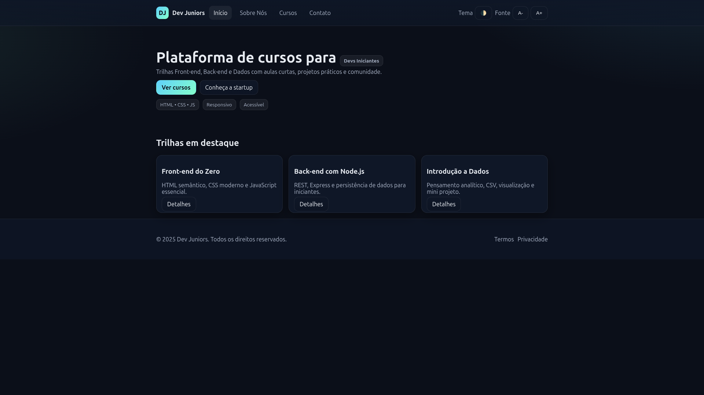

# DjDev Junior 

## 📋 Sobre o Projeto
**Instituição:** Etec Jacinto Ferreira de Sá  

**Equipe:**  
- Ana Vitória Marcelino da Cruz Vieira  
- Anny Gabrielly da Silva  
- Kewyn Marcelo Bueno Souza Lima  
- Pedro Bertaco Whiteman  

---

### 🔍 Descrição do Problema  
Muitas pessoas têm interesse em aprender tecnologia, mas não sabem por onde começar ou não encontram cursos acessíveis e organizados.  
A falta de recursos educativos gratuitos e claros dificulta o desenvolvimento de habilidades digitais.  

### 🚀 Descrição da Solução  
A **EducaTech** oferece uma plataforma online que organiza cursos introdutórios de tecnologia de forma clara, acessível e gratuita.  
O site apresenta os cursos, a equipe e formas de contato, facilitando o acesso ao aprendizado.  

---

## 🖼️ Prévia da Aplicação
  

---

## 🛠️ Tecnologias Utilizadas  
- **Tipo:** Aplicação Web  
- **Linguagens/Frameworks/Bancos de Dados:** HTML, CSS e JavaScript  

---

## ⚙️ Instalação e Execução  

### Pré-requisitos  
- Navegador web atualizado (Google Chrome, Firefox, Edge, etc.)  
- Não há dependências externas.  

### Instalação  
1. Clone o repositório:  
   ```bash
   git clone [URL_DO_REPOSITORIO]
